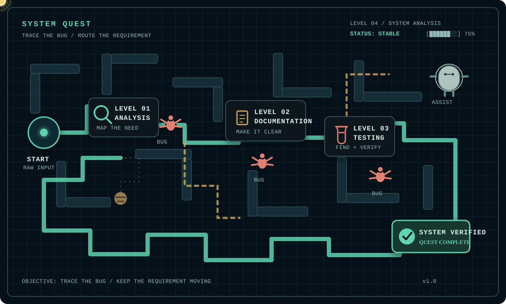

<div align="center">
  
</div>

# Aisyah's System

```text
┌──────────────────────────────────────────────────────────────┐
│  SYSTEM: AISYAH.NZ         STATUS: ONLINE                    │
│  MISSION: TURNING COMPLEXITY INTO CLARITY                    │
│  MODE:    QA / SYSTEM ANALYSIS / TECHNICAL WRITING           │
└──────────────────────────────────────────────────────────────┘
```

I work where **business needs meet working software**: understanding how a process should behave, making the logic visible, documenting it clearly, and testing the result until the details make sense.

<div align="center">
  <a href="https://github.com/aisyahnabila">GitHub</a> ·
  <a href="https://www.linkedin.com/in/aisyah-nabila-zahra-0a6046226/">LinkedIn</a> ·
  <a href="mailto:aisyahnabilaz514@gmail.com">Email</a> ·
  <a href="https://aisyahnabila.github.io/aisyahnabila-portofolio-website">Portfolio</a>
</div>

## System Status

| SIGNAL | CURRENT STATE |
|---|---|
| `ROLE` | System Analyst · Technical Writer · QA Enthusiast |
| `BACKGROUND` | B.CS. Information Systems, Telkom University, GPA 3.73/4.00 |
| `WORKING AREA` | Requirements · Business Processes · Documentation · Manual Testing |
| `TESTING MODE` | Functional · Regression · SIT · UAT · Exploratory |
| `CURRENT CURIOSITY` | System architecture · Security testing · Better technical communication |
| `LANGUAGE` | Indonesian (Native) · English (Intermediate/B2) |

## Operator Profile

I am an Information Systems graduate who enjoys making complicated systems easier to understand and safer to use. My work has moved between web development, system analysis, technical writing, and manual QA, which lets me see a feature from more than one angle.

I like questions such as: *What does the user actually need? What happens when the input is incomplete? Is the workflow documented well enough for another person to follow? Does the delivered feature behave as intended?* Analysis gives the system structure, documentation gives it a shared language, and testing gives that language a reality check.

## From Chaos to System

```text
  RAW REQUIREMENT       PROCESS MODEL       SHARED DOCUMENT       VERIFIED BEHAVIOUR
       CHAOS       ->       ANALYSIS     ->   DOCUMENTATION    ->       TESTING       ->  SYSTEM
```

<table>
  <tr>
    <td width="25%"><b>01 / ANALYSIS</b><br><br>Gather requirements, understand business processes, and turn stakeholder conversations into Use Cases, BPMN, ERD, and clear workflows.</td>
    <td width="25%"><b>02 / DOCUMENTATION</b><br><br>Build functional specifications, technical references, User Guides, Project Charters, Blueprints, MoM, Issue Logs, and Change Requests.</td>
    <td width="25%"><b>03 / TESTING</b><br><br>Prepare scenarios and test cases, execute functional, SIT, UAT, regression, and exploratory testing, then report and validate defects.</td>
    <td width="25%"><b>04 / SYSTEM</b><br><br>Help deliver software that is understandable, traceable, usable, and aligned with the requirement it started from.</td>
  </tr>
</table>

## Core Modules

### `analysis.core`

- Requirement gathering and business process analysis
- Use Case Diagram, BPMN, ERD, and functional specifications
- Multi-role workflow analysis and stakeholder clarification
- Business analysis, market and demand forecasting
- Tools: Draw.io, Visual Paradigm, ClickUp

### `documentation.core`

- Project Charters, Blueprints, Technical Specifications, and User Guides
- REST API references with Swagger
- MoM, Issue Logs, Change Requests, deployment reports, and handover material
- Documentation for technical and non-technical audiences
- ITIL-based workflow, Microsoft Word/Excel, Notion

### `qa.core`

- Manual, functional, regression, exploratory, SIT, and UAT testing
- STLC: requirement review through test-cycle closure
- Test scenario and test case design
- Bug reporting, retesting, validation, and post-deployment checks
- API testing with Postman and Swagger; automated tests with PHPUnit in project work

<!-- ## Project Database

### `WEBREPORT / EnamBelas Persada Indonesia`

**Type:** Vessel survey, cargo reporting, and finance platform<br>
**Role:** Web Developer · Manual QA · System Analysis support<br>
**Stack:** PHP 8.2 · Laravel 12 · Blade · Tailwind CSS 4 · MySQL · Swagger · PHPUnit<br>
**Contribution:** Analyzed multi-role operational and finance workflows, translated stakeholder needs into application flows, supported reporting and approval features, and validated financial reports against requirements.<br>
**Status:** Completed project work, Feb–Jul 2026

### `LITERA / Digital Publishing Platform`

**Type:** Digital publishing web platform and mobile application<br>
**Role:** Web Developer · Manual QA · Documentation support<br>
**Stack:** PHP · Laravel · JavaScript · Tailwind CSS · React Native · REST API · MySQL · Git · Ubuntu VPS<br>
**Contribution:** Supported releases 1–3 across 10+ modules, documented workflows and APIs, executed functional/SIT/UAT/regression testing, investigated defects, and performed post-deployment validation.<br>
**Status:** Active, Aug 2024–Present

### `TERNAKPARK / Farm Management Information System`

**Type:** Multi-role livestock, investor, and subscription management system<br>
**Role:** Web Developer · Manual QA · System Analysis support<br>
**Stack:** PHP · Laravel · JavaScript · MySQL · Bootstrap · Tailwind CSS · Midtrans · DomPDF · PhpSpreadsheet · PHPUnit<br>
**Contribution:** Gathered requirements, documented role-based workflows and Excel-import rules, built operational modules, and tested data validation, feature behaviour, and bulk imports.<br>
**Status:** In progress, Apr 2026–Present

### `CAREVENTORY / Inventory Management System`

**Type:** Web-based consumable inventory system<br>
**Role:** System Analysis · Web Developer · Manual QA<br>
**Stack:** PHP · Laravel · JavaScript · Tailwind CSS · MySQL<br>
**Contribution:** Designed Use Cases, BPMN, ERD, and functional specifications; developed digital transaction and reporting features; prepared the User Guide; and validated the system before deployment.<br>
**Status:** Completed, Jul–Sep 2024 · Web-based computer program IPR -->

## System Logs

```text
[2021–2025]  INFORMATION SYSTEMS / TELKOM UNIVERSITY
[2024]       WEB DEVELOPMENT / INVENTORY, ERP, AND DATA PROJECTS
[2024–2025]  LITERA / DIGITAL PUBLISHING PLATFORM
[NOV 2025]   TECHNICAL WRITING + QA SUPPORT / SEMEN INDONESIA
[FEB 2026]   WEBREPORT / OPERATIONAL AND FINANCE PLATFORM
[APR 2026]   TERNAKPARK / FARM MANAGEMENT SYSTEM
[NOW]        QA · SYSTEM ANALYSIS · TECHNICAL WRITING
```

## Technology Map

| AREA | TOOLS AND METHODS |
|---|---|
| Programming | PHP · JavaScript · Python · HTML · CSS |
| Frameworks | Laravel · React.js · Next.js · React Native · Bootstrap · Tailwind CSS |
| Data | MySQL · PostgreSQL · SQL Server · SPSS · R · Google Colab · Tableau · Power BI |
| Analysis | Requirement Gathering · BPMN · Use Case · ERD · Business Process Modelling |
| QA and API | Manual Testing · STLC · Functional · Regression · SIT · UAT · Exploratory · Postman · Swagger · PHPUnit |
| Documentation | Microsoft Word · Excel · PowerPoint · Notion · ClickUp |
| Platforms | Git · GitHub · Odoo ERP · Power Apps · Power Automate · Power BI · Ubuntu VPS |

## Learning Queue

```text
[RUNNING]  Deeper system analysis and architecture
[RUNNING]  Software quality, test design, and security testing
[RUNNING]  Technical documentation that stays useful across releases
[RUNNING]  Clearer English communication for technical collaboration
```

## System Quest

<div align="center">
  
</div>

<p align="center"><i>Trace the requirement. Find the bug. Verify the system.</i></p>

## Diagnostics

<details>
<summary>🔍 Run hidden diagnostic</summary>
<br>

```text
> RUNNING SELF-CHECK...

  ANALYSIS MODULE ......... OK
  DOCUMENTATION MODULE .... OK
  QA MODULE ............... OK
  COFFEE LEVEL ............ LOW
  UNREGISTERED PROCESS .... DETECTED (harmless, refuses to leave)

> DIAGNOSIS: System is healthy. One dependency is emotional support, not technical.
```

Cross-reference: an unregistered process was also logged wandering near LEVEL 01 in the [System Quest](#system-quest) map. It does not affect system stability.

</details>

## Publications and IP

- **Analysis of Digital Fraud Modus using BPMN** — Published paper, presented at SENASIF, 2023
- **Smart Village: A Conceptual Maturity Framework** — Collaborative research project
- **Conceptual Model of IT Strategy Implementation for Smart Village in the Society 5.0 Era** — IPR
- **Careventory: Consumable Inventory Management System** — Web-based computer program IPR

## GitHub Activity

<div align="center">
  <a href="https://github.com/aisyahnabila?tab=overview">View profile overview</a> ·
  <a href="https://github.com/aisyahnabila?tab=repositories">Browse repositories</a> ·
  <a href="https://github.com/aisyahnabila?tab=activity">View activity</a>
</div>

The activity panel is intentionally secondary. The main signal here is the work behind the systems, not a number on a card.

## Connect

<div align="center">
  <a href="https://github.com/aisyahnabila">GitHub</a> ·
  <a href="https://www.linkedin.com/in/aisyah-nabila-zahra-0a6046226/">LinkedIn</a> ·
  <a href="mailto:aisyahnabilaz514@gmail.com">aisyahnabilaz514@gmail.com</a> ·
  <a href="https://aisyahnabila.github.io/aisyahnabila-portofolio-website">Portfolio</a> ·
  <a href="https://www.instagram.com/aisyahnabila2.an/">Instagram</a>
</div>

<p align="center"><i>From chaos to system.</i></p>

